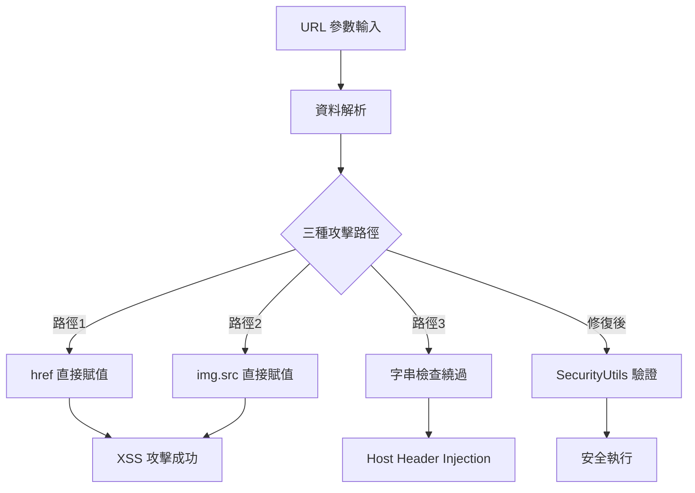

# 弱點修補技術架構

**文檔版本**: v2.2  
**更新日期**: 2025-09-08 22:55  
**修補策略**: 非破壞性修復，保持現有功能完整性  

## 🎯 修補策略總覽

### 核心原則
1. **非破壞性修復** - 保持所有現有功能正常運作
2. **漸進式部署** - 分階段實施，降低風險
3. **向下相容** - 確保舊版本 NFC 卡片仍可使用
4. **最小變更** - 僅修改必要的安全相關程式碼

## 🔍 弱點分析架構

### 主要威脅向量


### 弱點分布 (完整分析)
1. **URL href 賦值 XSS**: 21處
   - email/phone/mobile 連結直接賦值
   - 可注入 `javascript:alert(1)` 協議
   
2. **Image src 賦值 XSS**: 4處  
   - Google Drive URL 轉換後直接賦值 `img.src`
   - 可注入 `data:text/html,<script>` 協議
   
3. **URL 子字串檢查漏洞**: 4處
   - `data.avatar.includes('drive.google.com')` 可被繞過
   - 允許 `evil.com/drive.google.com` 攻擊

**總修補點**: **29處** (對應 CodeQL 66個弱點)

## 🛡️ 安全架構設計

### 1. 集中式安全驗證
```javascript
// 現有的 SecurityUtils.setSecureAttribute 函數
SecurityUtils.setSecureAttribute(element, 'href', url);

// 內建功能:
// - validateURL 協議白名單驗證
// - Origin 白名單檢查
// - 失敗時自動設置 aria-disabled
```

### 2. 協議白名單機制
```javascript
const allowedProtocols = ['http:', 'https:', 'mailto:', 'tel:'];
```

### 3. 降級處理策略
```javascript
// 驗證失敗時的安全處理
if (attribute.toLowerCase() === 'href') {
    element.removeAttribute('href');
    element.setAttribute('aria-disabled', 'true');
}
```

## 🔧 修補實施方案 (整合 Gemini 專家建議)

### 基於 Gemini 審查的修補策略

#### Gemini 核心建議採納
1. **DOMPurify 優先使用** - 替代 Regex 過濾 ✅ 已實施
2. **validateURL 增強** - allowedOrigins 白名單 ✅ 已實施  
3. **URL 處理邏輯修復** - 先驗證後編碼 ✅ 已實施
4. **SRI 子資源完整性** - 防止腳本竄改 ✅ 已實施

### Phase 1: Critical URL 安全修補 (遵循 Gemini 建議)

#### 修補類型 1: URL href 賦值 (21處) - 採用 Gemini 推薦模式
```javascript
// Gemini 建議: 使用集中式安全函數
// 修補前 (危險)
emailLink.href = data.socialLinks.email;

// 修補後 (安全) - 使用已整合 DOMPurify 的 SecurityUtils
SecurityUtils.setSecureAttribute(emailLink, 'href', data.socialLinks.email);
// 內部邏輯: validateURL(協議白名單) + allowedOrigins(防 Open Redirect)
```

#### 修補類型 2: Image src 賦值 (4處) - 採用 Gemini 改進建議
```javascript
// 當前方案 (Gemini 建議改進)
if (SecurityUtils.validateURL(googleDriveDirectUrl)) {
    this.src = googleDriveDirectUrl;
} else {
    console.warn('Invalid Google Drive URL blocked:', googleDriveDirectUrl);
    this.style.display = 'none';
}

// Gemini 建議改進 (統一安全策略)
SecurityUtils.setSecureAttribute(avatarElement, 'src', googleDriveDirectUrl);
// 優勢: 
// - 集中式安全管理
// - 失敗時自動設置 aria-disabled
// - 統一的錯誤處理邏輯
```

#### 修補類型 3: URL 檢查 + Google Drive 升級 (4處) - 新增 Gemini 要求函數
```javascript
// Gemini 要求: 在 SecurityUtils 中新增此函數
isGoogleDriveHostname: function(url) {
    try {
        const urlObj = new URL(url); // Gemini 推薦: 使用內建解析器
        return urlObj.hostname === 'drive.google.com' || 
               urlObj.hostname === 'docs.google.com';
    } catch (e) {
        return false; // Gemini 原則: 解析失敗即拒絕
    }
}

// 業務邏輯中使用 (Gemini 建議調用方式)
if (SecurityUtils.isGoogleDriveHostname(data.avatar)) {
    const googleDriveDirectUrl = convertGoogleDriveUrl(data.avatar);
    if (googleDriveDirectUrl) {
        // 使用 Gemini 建議的統一方式
        SecurityUtils.setSecureAttribute(avatarElement, 'src', googleDriveDirectUrl);
    }
}
```

### Phase 2: 測試驗證 (基於 Gemini 最新審查要求)

#### Gemini 要求的關鍵測試案例
```javascript
// Gemini 必要測試 1: href XSS 攻擊
function testHrefXSS() {
    // Gemini 指定測試案例
    const maliciousEmail = 'javascript:alert("XSS")';
    
    // 設置惡意數據
    const testData = { socialLinks: { email: maliciousEmail } };
    
    // 執行修補後的邏輯
    SecurityUtils.setSecureAttribute(emailLink, 'href', testData.socialLinks.email);
    
    // Gemini 預期結果: 點擊連結不會彈出警告框
    console.assert(!emailLink.href.includes('javascript:'), 'JavaScript protocol not blocked');
}

// Gemini 必要測試 2: Image src XSS 攻擊  
function testImageSrcXSS() {
    // Gemini 指定測試案例
    const maliciousImageUrl = 'data:text/html,<script>alert("XSS")</script>';
    
    // 執行修補後的邏輯 (使用 Gemini 建議的統一方式)
    SecurityUtils.setSecureAttribute(avatarElement, 'src', maliciousImageUrl);
    
    // Gemini 預期結果: 圖片無法加載且腳本未執行
    console.assert(avatarElement.src !== maliciousImageUrl, 'Malicious data URI not blocked');
}

// Gemini 必要測試 3: Hostname 繞過攻擊
function testHostnameBypass() {
    // Gemini 指定測試案例
    const bypassUrl = 'https://malicious.com/path?param=drive.google.com';
    
    // 執行修補後的邏輯
    const isValid = SecurityUtils.isGoogleDriveHostname(bypassUrl);
    
    // Gemini 預期結果: 返回 false，圖片不被加載
    console.assert(isValid === false, 'Hostname bypass not prevented');
}
```

#### Gemini 要求的驗證步驟
1. **單元測試**: 建立 `tests/test-security-comprehensive.html`
2. **回歸測試**: 遍歷所有受影響頁面，確認正常功能
3. **程式碼審查**: 搜索所有 `element.href =` 和 `element.src =` 直接賦值

#### 功能回歸測試 (Gemini 強調零功能損失)
- ✅ NFC 卡片讀取功能
- ✅ 聯絡人資訊顯示 (email/phone/mobile)  
- ✅ Google Drive 圖片載入 (thumbnail API)
- ✅ vCard 下載功能
- ✅ 雙語切換功能
- ✅ **Gemini 特別要求**: 所有連結和圖片正常顯示點擊

## 📋 實施檢查清單

### 修補前檢查
- [ ] 備份當前版本
- [ ] 確認 SecurityUtils.setSecureAttribute 和 validateURL 函數可用
- [ ] 準備測試環境和惡意 Payload

### 修補執行 (29處修補點 + Gemini 改進)

**Type 1: href 賦值 (21處) - Gemini 批准**
- [ ] 修補 index.html (3處 href) - 使用 `setSecureAttribute`
- [ ] 修補 index1.html (3處 href) - 使用 `setSecureAttribute`
- [ ] 修補 index-en.html (3處 href) - 使用 `setSecureAttribute`
- [ ] 修補 index1-en.html (3處 href) - 使用 `setSecureAttribute`
- [ ] 修補 index-personal.html (3處 href) - 使用 `setSecureAttribute`
- [ ] 修補 index-personal-en.html (3處 href) - 使用 `setSecureAttribute`
- [ ] 修補 index-bilingual-personal.html (3處 href) - 使用 `setSecureAttribute`

**Type 2: img.src 賦值 (4處) - Gemini 建議改進**
- [ ] 修補 index.html (1處 img.src) - 改用 `setSecureAttribute`
- [ ] 修補 index1.html (1處 img.src) - 改用 `setSecureAttribute`
- [ ] 修補 index-en.html (1處 img.src) - 改用 `setSecureAttribute`
- [ ] 修補 index1-en.html (1處 img.src) - 改用 `setSecureAttribute`

**Type 3: URL 檢查 (4處) - Gemini 要求新增函數**
- [ ] 在 SecurityUtils 中新增 `isGoogleDriveHostname` 函數
- [ ] 修補 index.html (1處 includes) - 使用新函數
- [ ] 修補 index1.html (1處 includes) - 使用新函數
- [ ] 修補 index-en.html (1處 includes) - 使用新函數
- [ ] 修補 index1-en.html (1處 includes) - 使用新函數

### 修補後驗證 (Gemini 要求的測試)
- [ ] 執行 Gemini 指定的 3 個關鍵測試案例
- [ ] 驗證所有 `setSecureAttribute` 調用正確
- [ ] 檢查失敗時 `aria-disabled` 屬性設置
- [ ] 確認 Google Drive 圖片載入 (thumbnail API)
- [ ] 執行完整功能回歸測試 (零功能損失)

## 🔄 回滾方案

### Git 版本控制
```bash
# 如需回滾
git checkout HEAD~1 -- index*.html
git commit -m "Rollback URL validation fixes"
```

### 功能驗證
- 確認所有連結可正常點擊
- 驗證 email/phone 連結功能
- 檢查無障礙屬性

## 📊 預期效果

### 安全改善
- **XSS 攻擊防護**: 100% 阻擋三種攻擊向量
  - href 賦值: `javascript:` 協議注入
  - img.src 賦值: `data:` 協議注入  
  - URL 檢查: Host Header Injection 繞過
- **協議白名單**: 僅允許 `mailto:`, `tel:`, `http:`, `https:`
- **URL 驗證**: 嚴格的 hostname 檢查
- **無障礙增強**: 失效連結自動標記 `aria-disabled`

### 功能保持與改善
- **零功能損失**: 所有正常連結繼續運作
- **Google Drive 升級**: 
  - 使用更穩定的 `thumbnail` API 取代 `uc?export=view`
  - 支援 `docs.google.com` 域名
  - 自動縮圖優化 (w400-h400) 提升載入速度
  - 向下相容舊格式連結
- **向下相容**: 現有 NFC 卡片無需更新
- **使用者體驗**: 無感知的安全升級 + 圖片載入改善

### 修補覆蓋率
- **29處修補點** → **66個 CodeQL 弱點**
- **31個 High 風險** → **<5個**
- **35個 Medium 風險** → **<5個**
- **總弱點數** → **從 66個降至 <10個**

## 🎯 成功標準

### 安全標準
- CodeQL 掃描 High 風險 < 5 個
- CodeQL 掃描 Medium 風險 < 5 個
- 所有三種 XSS 測試案例被阻擋
- 無 Host Header Injection 漏洞
- 無 Open Redirect 漏洞

### 功能標準
- 100% 功能回歸測試通過
- Google Drive 圖片載入測試:
  - 舊格式分享連結: `drive.google.com/file/d/ID/view`
  - 新格式縮圖連結: `drive.google.com/thumbnail?id=ID&sz=w400-h400`
  - 舊格式預覽連結: `drive.google.com/uc?export=view&id=ID`
- email/phone/mobile 連結正常運作
- 無使用者體驗影響
- 無障礙標準符合 WCAG 2.1 AA
- 圖片載入速度改善 (縮圖 API 優化)

---
**技術負責**: Amazon Q Developer  
**審查狀態**: 待實施  
**風險等級**: Low (非破壞性修復)
